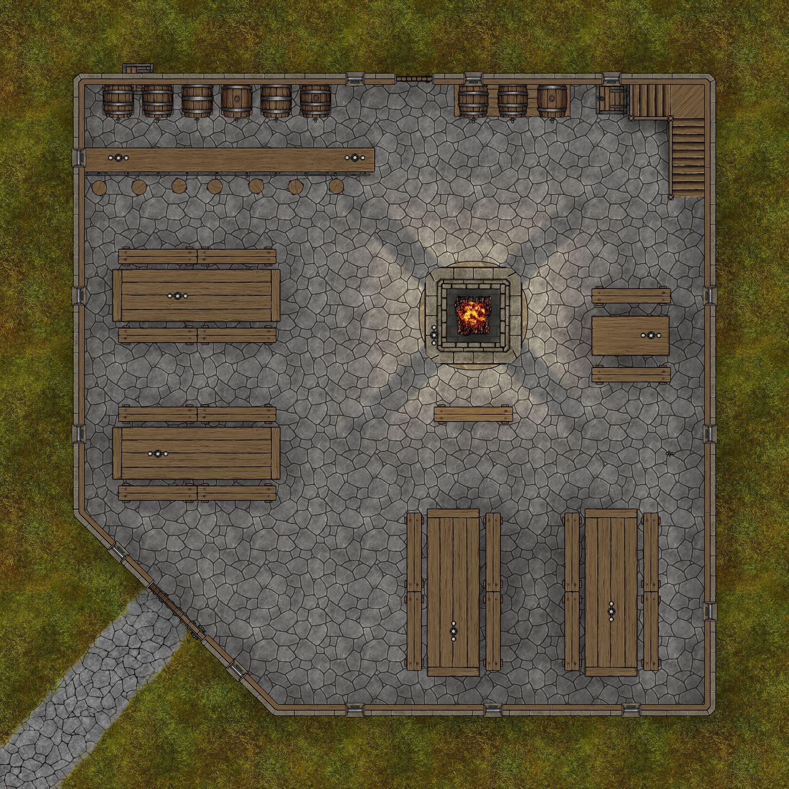

NOTE! This module is undergoing final revisions and bugfixes and is not quite ready for prime time. It is also not yet available in Foundry.

Tianze's Gauntlight Extras is a collection of of content designed to enhance the gameplay of Paizo's <em>Abomination Vaults Adventure Path</em>.

It includes annotated and soundscaped versions of each scene in the adventure path, up to the seventh level, plus additional side quests, expanded storylines, and NPC timelines.

The maps for Levels 8 through 10 are planned for a later update.

Original maps were created with <a href="https://dungeondraft.net/" title="DungeonDraft" style="box-sizing:border-box;user-select:text;cursor:pointer;color:var(--color-text-hyperlink)">DungeonDraft</a> using assets from <a href="https://www.forgotten-adventures.net/" title="Forgotten Adventures" style="box-sizing:border-box;user-select:text;cursor:pointer;color:var(--color-text-hyperlink)">Forgotten Adventures</a>.

Vignettes, character art and tokens were created using any of these:

<ul>
    <li>
        
<a href="http://localhost:30000/forgotten-adventures.net" style="box-sizing:border-box;user-select:text;cursor:pointer;color:var(--color-text-hyperlink);transition:text-shadow 0.15s ease-in-out 0s, background-color 0.15s ease-in-out 0s, border 0.15s ease-in-out 0s, color 0.15s ease-in-out 0s, box-shadow 0.15s ease-in-out 0s, backdrop-filter 0.15s ease-in-out 0s, border-radius 0.15s ease 0s">Forgotten Adventures</a>

    </li>
    <li style="box-sizing:border-box;user-select:text">
        
<a href="https://rolladvantage.com/tokenstamp">RollAdvantage's Token Stamp</a>

    </li>
    <li style="box-sizing:border-box;user-select:text">
        
<a href="https://www.bing.com/images/create" style="box-sizing:border-box;user-select:text;cursor:pointer;color:var(--color-text-hyperlink);transition:text-shadow 0.15s ease-in-out 0s, background-color 0.15s ease-in-out 0s, border 0.15s ease-in-out 0s, color 0.15s ease-in-out 0s, box-shadow 0.15s ease-in-out 0s, backdrop-filter 0.15s ease-in-out 0s, border-radius 0.15s ease 0s">Bing Image Creator</a>

    </li>
    <li style="box-sizing:border-box;user-select:text">
        
<a href="https://www.heroforge.com/">HeroForge</a>

    </li>
</ul>

The <em>Abomination Vaults Advanture Path</em> Foundry module is required for this mod to function. Many of the scenes, actors, journals and items in this module points directly to assets in the Abomination Vaults module folder.

<h2>Overview</h2>

This module includes:

<ul>
    <li>
        
New original scenes for:

        <ul>
            <li>
                
Dawnflower Library

            </li>
            <li>
                
Rowdy Rockfish

            </li>
            <li>
                
Secluded Clearing

            </li>
            <li>
                
Gauntlight Extras Landing, for theater of mind play.

            </li>
        </ul>
    </li>
    <li>
        
A new version of every scene that shipped with Abomination Vaults, up to Level 7, with soundscapes, additional lighting, gameplay suggestions, tiles, and map pins to relevant Abomination Vaults vignettes. These scenes use the remade maps.

    </li>
    <li>
        
A journal that organizes every vignette that shipped with Abomination Vaults.

    </li>
    <li>
        
Journals detailing all changes to maps, including a comprehensive list of changes.

    </li>
    <li>
        
New actors for Otari, plus actors for each Otari citizen portrait (and token art) that shipped with Abomination Vaults.

    </li>
    <li>
        
New actors for the Gauntlight dungeons, including an alternate level boss, her allies, a Gamesmaster for the Arena, loot boxes, and a victim to rescue.

    </li>
    <li>
        
A competing adventurer gang, and their tragic story.

    </li>
    <li>
        
Ghostly versions of each member of the Roseguard, with skills and spells that persisted into their undeath, and their expanded story.

    </li>
    <li>
        
Convenient magic items to organize the many keys and books found in the Vaults, which will help preserve the gamemaster's sanity as well as the players.

    </li>
    <li>
        
A folder of effects for the various longterm afflictions the heroes may contract while on the adventure.

    </li>
    <li>
        
Reanimations of once-killed monsters and bosses, handy for villains who like to raise dead.

    </li>
</ul>

Everything is organized in an Adventure compendium for easy installation.

<h2></h2>Sample Map - The Rowdy Rockfish</h2>

