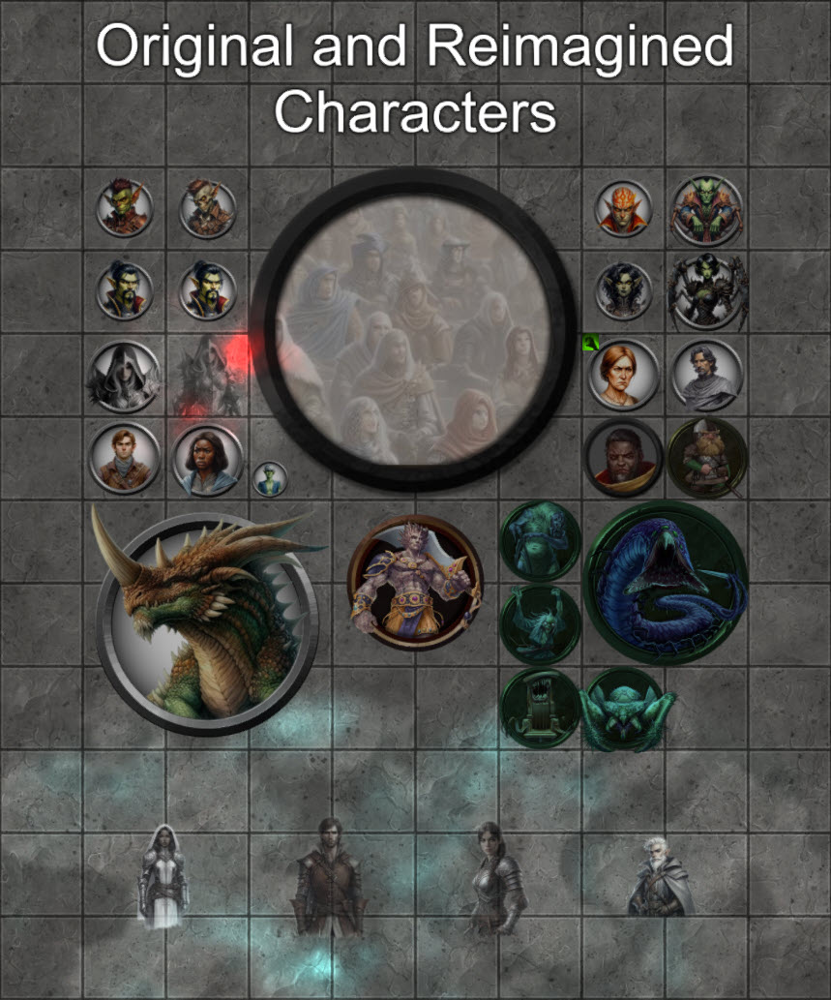

<H2>Version 1.3.1 Character Art</H2>
Small release to add token images that were not included in the original module: Shaitan and the two hags on the 7th level.
<H2>Version 1.3.0 Hunting Grounds Added!</H2>

For this update, I am adding all three scenes for the Hunting grounds.

It features a neutral horned dragon to replace the old OGL dragon, his side quests, a general store in Yldaris, environmental enhancements for Yldaris, and a conclusion to the caligni storyline.

It also makes a few light tweaks to the Farm level.

I also added the Wall Height mod, and several others, to my list of recommendations.

Tianze's Gauntlight Extras is a collection of of content designed to enhance the gameplay of Paizo's <em>Abomination Vaults Adventure Path</em> (often abbreviated to AV).

It includes annotated and soundscaped versions of each scene in the adventure path, up to the <strong>eigth</strong> level, plus additional side quests, expanded storylines, and NPC timelines.

The <em>Abomination Vaults Adventure Path</em> Foundry module is required for this mod to function. Many of the scenes, actors, journals and items in this module points directly to assets in the Abomination Vaults module folder.

The maps for Levels 9 through 10 are planned for a later update.

Assets shipped with this module were created using several tools:

<ul>
    <li>
        
Original maps were created with <a href="https://dungeondraft.net/">DungeonDraft</a> using assets from <a href="https://www.forgotten-adventures.net/">Forgotten Adventures</a>.

    </li>
    <li>
        
Vignettes, character art and tokens were created using any of these:

        <ul>
            <li>
                
<a href="https://www.bing.com/images/create">Bing Image Creator</a>

            </li>
            <li>
                
<a href="https://affinity.serif.com/en-gb">Affinity Designer and Photo</a>

            </li>
            <li>
                
<a href="https://www.faststone.org/">Faststone Image Viewer</a>

            </li>
            <li style="box-sizing:border-box;user-select:text">
                
<s>HeroForge</s>

            </li>
        </ul>
    </li>
</ul>
<h2>Overview</h2>

This module includes:

<ul>
    <li>
        
New original scenes for:

        <ul>
            <li>
                
Dawnflower Library

            </li>
            <li>
                
Rowdy Rockfish

            </li>
            <li>
                
Secluded Clearing

            </li>
            <li>
                
Gauntlight Extras Landing, for theater of mind play.

            </li>
        </ul>
    </li>
    <li>
        
A new version of every scene that shipped with Abomination Vaults, up to Level 8, with soundscapes, additional lighting, gameplay suggestions, tiles, and map pins to relevant Abomination Vaults vignettes. These scenes point to the remade maps.

    </li>
    <li>
        
A journal that organizes every vignette that shipped with Abomination Vaults.

    </li>
    <li>
        
Journals detailing all changes to maps, including a comprehensive list of changes.

    </li>
    <li>
        
New actors for Otari, plus actors for each Otari citizen portrait (and associated token art) that shipped with Abomination Vaults.

    </li>
    <li>
        
New actors for the Gauntlight dungeons, including an alternate level boss, her allies, a Gamesmaster for the Arena, loot boxes, and a victim to rescue.

    </li>
    <li>
        
A competing adventurer gang, and their tragic story.

    </li>
    <li>
        
Ghostly versions of each member of the Roseguard, with skills and spells that persisted into their undeath, and their expanded story.

    </li>
    <li>
        
Convenient magic items to organize the many keys and books found in the Vaults, which will help preserve the gamemaster's sanity as well as the players.

    </li>
    <li>
        
A folder of effects for the various longterm afflictions the heroes may contract while on the adventure.

    </li>
    <li>
        
Reanimations of select once-killed monsters and bosses, handy for villains who like to raise dead.

    </li>
</ul>

Everything is organized in an Adventure compendium for easy installation.

<h2>Sample Map - The Rowdy Rockfish</h2>

<h2>Original and Reimagined Characters</h2>

